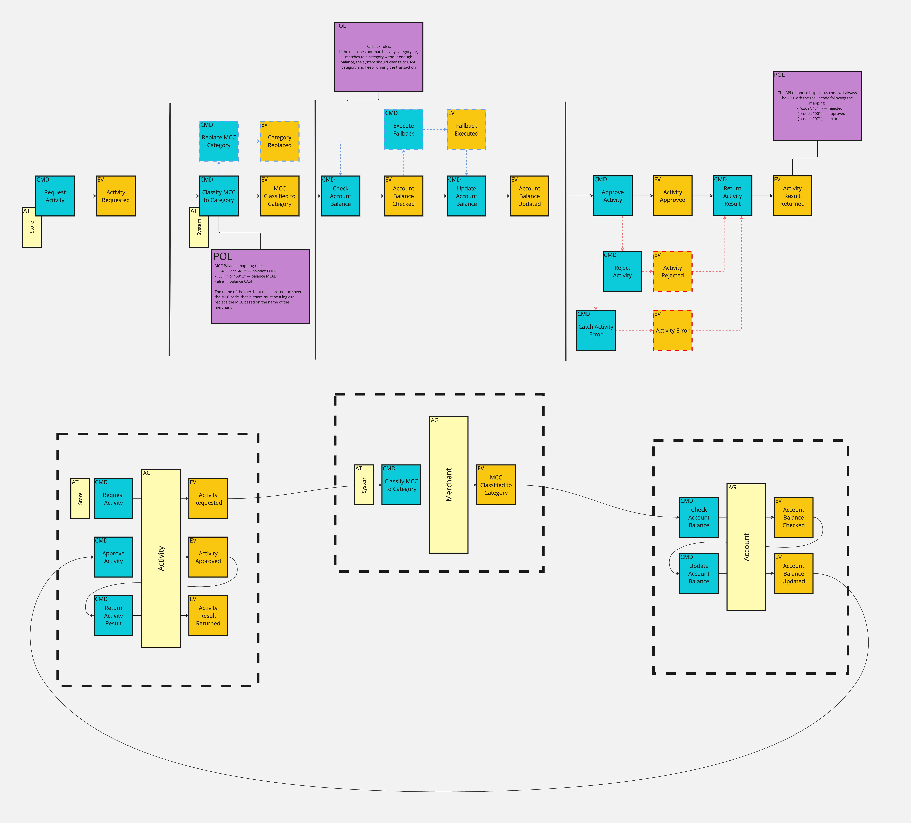
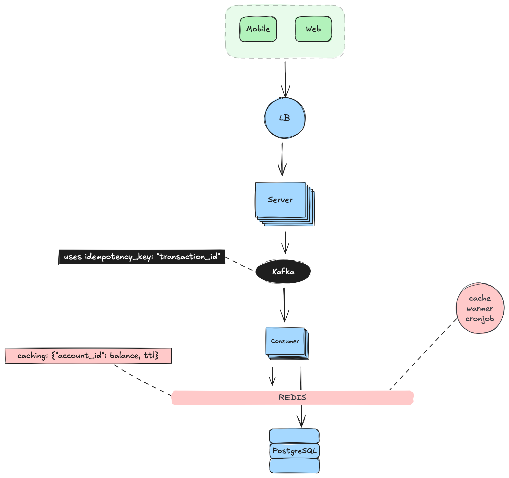
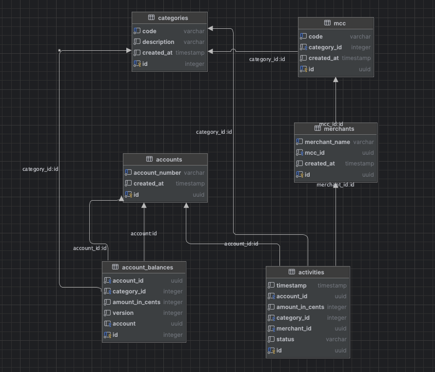

# swift_edge_ledger

[](https://codecov.io/gh/arthurgabriel73/swift_edge_ledger)

## Introduction
###### Swift Edge Ledger is a decentralized ledger system designed to provide secure, transparent, and efficient transaction processing across multiple nodes. This API allows users to interact with the ledger, manage accounts, and perform transactions.

### Video
[](https://www.youtube.com/watch?v=1234567890)

## Summary
* [Technology Stack](#technology-stack)
* [Domain-Driven Design](#domain-driven-design)
* [System Design](#system-design)
* [Database Design](#database-design)
* [Architecture](#architecture)
* [CI/CD](#cicd)
* [Executing the project](#executing-the-project)
* [API Documentation](#api-documentation)
* [Testing](#testing)

## Technology Stack
- Python 3.13
- FastAPI
- PostgreSQL
- SQLAlchemy
- Alembic
- Docker
- Docker Compose
- Pytest
- Codecov
- Behave
- Pydantic
- Swagger UI
- Uvicorn

## Domain-Driven Design
The system is designed using Domain-Driven Design (DDD) principles, focusing on the core domain of ledger management. The main components include:
- **Account**: Represents a user account in the ledger.
- **Merchant**: Represents a merchant account that can process transactions.
- **Activity**: Represents a transaction or activity in the ledger.

### Domain StoryTelling
The domain is modeled using Domain StoryTelling (DST) to capture the interactions and behaviors of the system. The main entities and their relationships are defined, allowing for a clear understanding of the system's functionality.

[Go to page beginning](#swift_edge_ledger)


### Event Storming
Event Storming is used to identify the key events in the system, such as account creation, activity processing, and merchant management. This helps in understanding the flow of data and the interactions between different components.


## System Design
The system is designed to be modular and scalable, allowing for easy addition of new features and components. The current version is a basic API, the following architecture components are planned for future versions to enhance performance and scalability:


## Database Design
The database is designed using PostgreSQL, with the following main tables:


## Architecture
The architecture chosen for the system is based on a Ports and Adapters (Hexagonal) architecture, which allows for separation of concerns and easy integration with external systems. The main components include:
- domain: Contains the core business logic and domain models.
- application: Contains the application logic and use cases, also the Driver/Driven ports with the Commands (input models).
- infrastructure: Contains the implementation of the ports, such as database access, external APIs, and other integrations.

## CI/CD
The CI/CD pipeline is set up to ensure that the code is tested and deployed automatically. The pipeline includes:
- Testing with Pytest and Behave, failing if the coverage is below 80%.
- Code coverage reporting with Codecov.

[Go to page beginning](#swift_edge_ledger)
## Executing the project
### Prerequisites

- Docker
- Docker Compose

### Execution Steps
```bash
docker compose up
```
```bash
alembic upgrade head
```

### Accessing the API
Once the project is running, you can access the API documentation at: http://localhost:8000/

[Go to page beginning](#swift_edge_ledger)
### Testing Best Practices
During development, it is recommended to follow best practices for testing, including:
- Writing unit tests
- Writing integration tests
- Using Behave for behavior-driven development (BDD) tests

This application uses the test pyramid approach, focusing on unit tests and acceptance tests, with a smaller number of acceptance tests.
We are using pytest for unit tests and Behave for acceptance/BDD tests. The test suite is designed to ensure that the core functionality of the system is thoroughly tested.
An BDD test example:
```gherkin
Feature: Account
  As a user
  I want to create an new account
  So that I can manage my account balance and transactions

  Scenario: Create a new account
    Given I have a valid account creation request
    When I send the request to create a new account
    Then I should receive a response with status code 201
    And the response should contain the account details
    And the account should be created in the system

  Scenario: Create an account with invalid data
    Given I have an invalid account creation request
    When I send the request to create a new account
    Then I should receive a response with status code 400
    And the response should contain an error message indicating the account validation failure

  Scenario: Create an account with already existing account number
    Given I have an account creation request with an existing account number
    When I send the request to create a new account
    Then I should receive a response with status code 409
    And the response should contain an error message indicating that the account already exists
```

We have the other acceptance tests defined in the `src/tests/acceptance/features` directory, which cover various scenarios for accounts, merchants, and activities.

### Code Coverage
The code coverage is measured using Codecov, and the tests are expected to cover at least 80% of the codebase. The coverage report can be viewed on the Codecov dashboard: [Codecov Dashboard](https://codecov.io/gh/arthurgabriel73/swift_edge_ledger)

### Extra
I have defined some seeds in `src/main/shared/database/seeds`. This is to help you to test the application without having to create accounts, merchants, and activities manually. You can move the seeds to the migrations folder, **after running the actual migrations**, and run the seeds using the following command:
```bash
alembic upgrade head
```